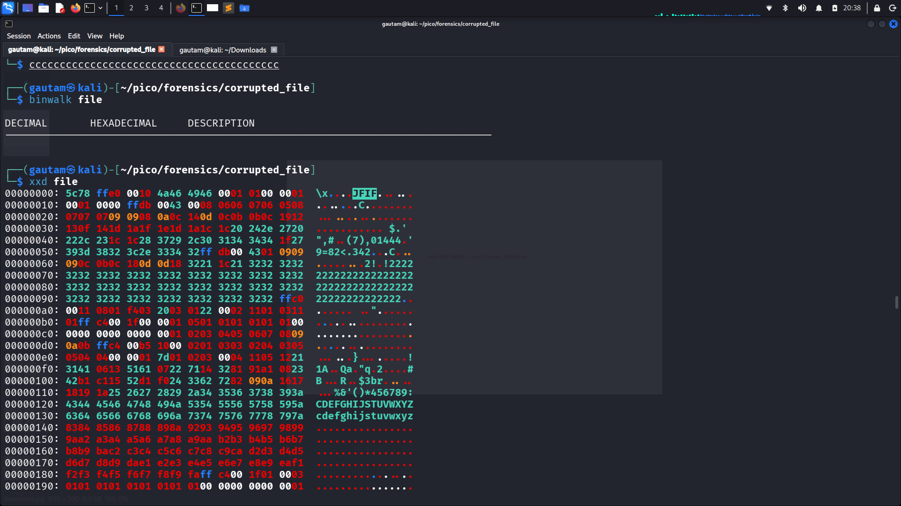

# PICO CTF
# Challenge : Corrupted file    
# Problem 
In the first sighyt the file seems broken or **corrupted** , this file is doesn't open in normal click. 

 

## Approach 

 When i see the file the file doesn't open in first click , when i use "file" command on the document file ,i found that this is a JFIF image type , [JFIF - JPEG File Interchange Format ] , so i use the "xxd" command and i found this type of hex 

   
    

 

  And this is also showing that this is a JFIF image type , so i have to change the JFIF image to JPEG . 

  ## Steps 
  1. Identify the file type 
     command : **file file**
     i found JFIF in file type . 
      

  2. Use "xxd" command to inspect RAW data . 
    command : **xxd file**.     

  1. Then i use the "hexedit" command   and change the JFIF hex to JPEG hex . 
     [FF D8 FF E0 00 10 4A 46 49 46 00 01]    
     command :  **hexedit file** .

  2. After this i save the hex and i agin open the file than i found the flag :

       

# Commands 
1. file file 
2. exiftool file [NEGATIVE]
3. strings file [NEGATIVE]
4. binwalk file [NEGATIVE] 
5. xxd file 
6. hexedit file   
                 
                  

