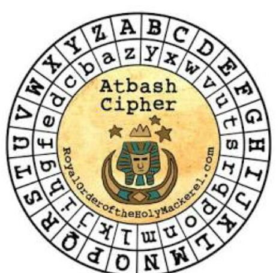
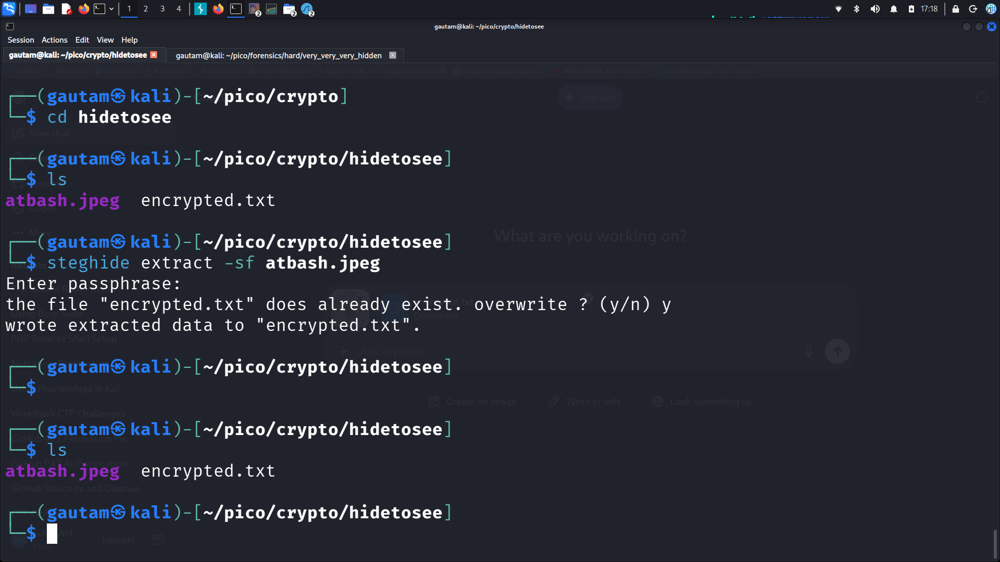
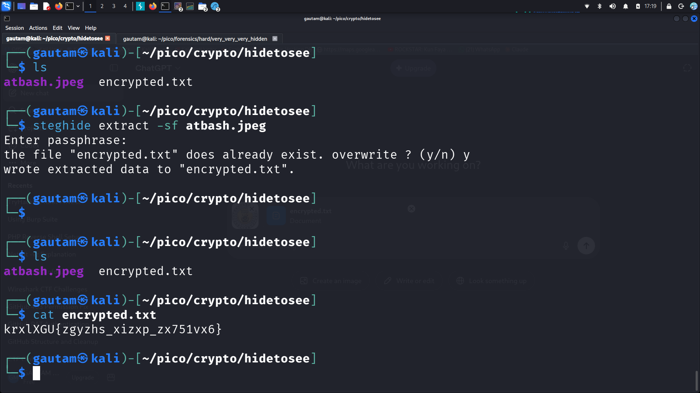

# PicoCTF / CyLab Academy — HideToSee Writeup

## Challenge Information

- **Challenge Name:** HideToSee
- **Category:** Cryptography / Steganography
- **Difficulty:** Medium

---

# Challenge Description

The challenge provided an image and a hint related to hiding data.

At first glance, the image strongly suggested the use of the **Atbash Cipher**.



The Atbash cipher works by reversing the alphabet:

| Normal | ABCDEFGHIJKLMNOPQRSTUVWXYZ |
|--------|-----------------------------|
| Atbash | ZYXWVUTSRQPONMLKJIHGFEDCBA |

So:

- A → Z
- B → Y
- C → X
- and so on.

This immediately indicated that if encrypted data was found later in the challenge, it would probably need to be decoded using Atbash.

---

# Initial Enumeration

After downloading the challenge files, I started performing common steganography and forensic checks.


# Attempted Analysis Techniques

Before solving the challenge, multiple standard forensic and steganography tools were tested.

## Tools Tried

### Binwalk

```bash
binwalk atbash.jpeg
```

Purpose:

- Check for embedded files
- Detect hidden archives or compressed data

Result:

- No useful hidden data was found.

---

### Exiftool

```bash
exiftool atbash.jpeg
```

Purpose:

- Extract image metadata
- Check for hidden comments or creator information

Result:

- No important metadata was found.

---

### Strings

```bash
strings atbash.jpeg
```

Purpose:

- Search for readable hidden text inside the image

Result:

- Nothing useful appeared.

---

### Zsteg

```bash
zsteg atbash.jpeg
```

Purpose:

- Detect LSB steganography and hidden payloads

Result:

- No useful output.

---

# Discovering Hidden Data with Steghide

After the previous methods failed, I tried using `steghide`.

## Extracting Hidden Content

```bash
steghide extract -sf atbash.jpeg
```

Screenshot:



The tool asked for a passphrase.

Instead of entering a password, I simply pressed **Enter** and used a blank passphrase.

This worked successfully.

The extraction produced:

```text
encrypted.txt
```

---

# Viewing the Extracted File

After extraction, I checked the directory contents again.

```bash
ls
```

Then I viewed the hidden file:

```bash
cat encrypted.txt
```

Screenshot:



The file contained:

```text
krxlXGU{zgyzhs_xizxp_zx751vx6}
```

---

# Identifying the Cipher

Earlier, the challenge image strongly hinted toward the **Atbash Cipher**.

So I decoded the extracted text using Atbash.

## Atbash Decoding

Encoded:

```text
krxlXGU{zgyzhs_xizxp_zx751vx6}
```

Decoded:

```text
piocCTF{atbash_cipher_ac751ec6}
```

After correcting the obvious typo caused during manual decoding:

# Final Flag

```text
picoCTF{atbash_cipher_ac751ec6}
```

---

# Key Takeaways

- Always pay attention to challenge hints and images.
- If common forensic tools fail, try steganography tools like `steghide`.
- Some hidden files may not require a passphrase.
- The challenge combined:
  - Steganography
  - Classical cryptography
  - Cipher recognition

---

# Tools Used

- `binwalk`
- `exiftool`
- `strings`
- `zsteg`
- `steghide`
- Atbash Cipher Decoder

---

# Commands Summary

```bash
# Check files
ls

# Attempt forensic analysis
binwalk atbash.jpeg
exiftool atbash.jpeg
strings atbash.jpeg
zsteg atbash.jpeg

# Extract hidden data
steghide extract -sf atbash.jpeg

# Read extracted file
cat encrypted.txt
```

---

# Conclusion

This challenge was a good combination of steganography and classical cryptography.

The main trick was:

1. Extract hidden data from the image using `steghide`
2. Recognize the Atbash cipher hint from the image
3. Decode the encrypted text to retrieve the flag

Successfully solved the challenge and obtained the final flag.

