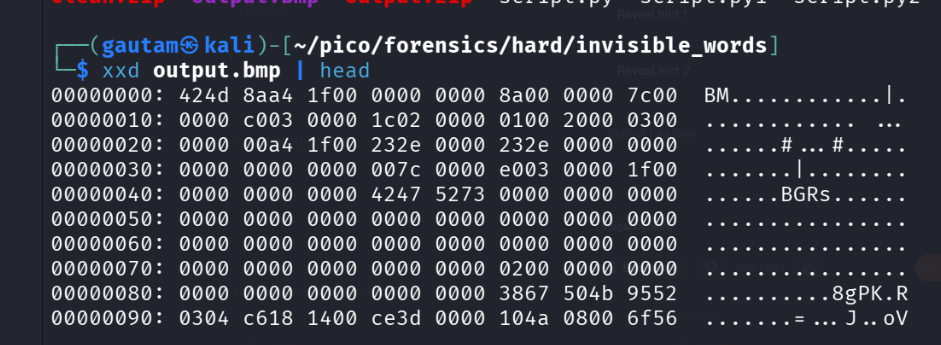
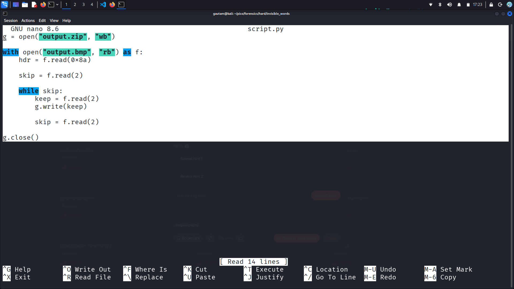
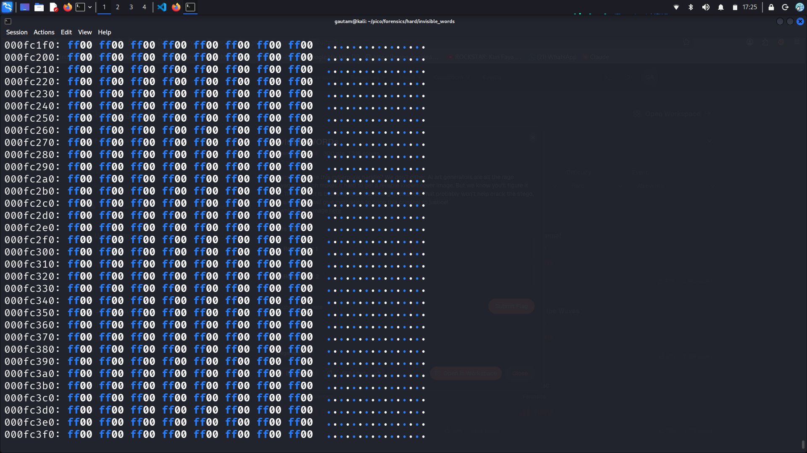
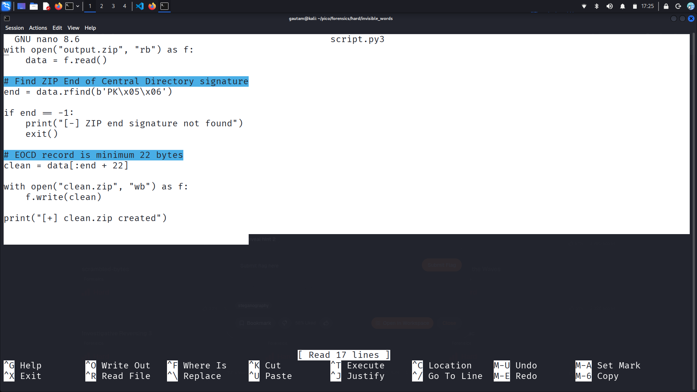
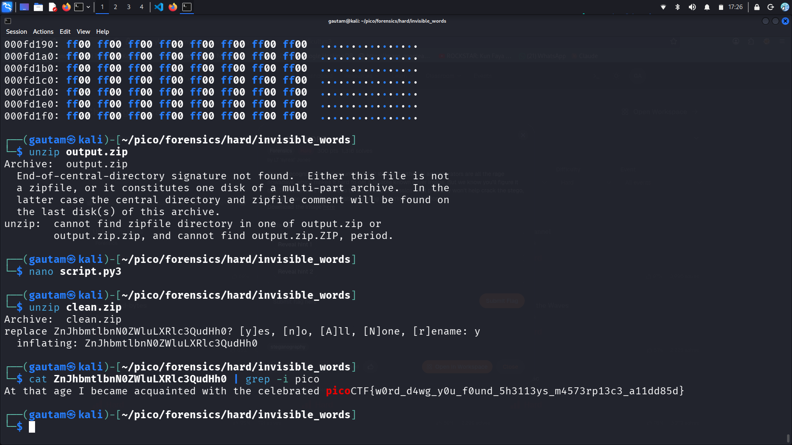

# PICOCTF - Invisible Words

## Challenge Description


> Do you recognize this cyberpunk baddie? We don't either. AI art generators are all the rage nowadays, which makes it hard to get a reliable known cover image. But we know you'll figure it out. The suspect is believed to be trafficking in classics. That probably won't help crack the stego, but we hope it will give motivation to bring this criminal to justice!

---

# Initial Analysis

## File Identification

I started the analysis by identifying the file type using the `file` command.

```bash
file output.bmp
```

The output confirmed that the challenge file was a BMP image containing a cyberpunk-themed picture.

---

## Basic Enumeration

Next, I searched for readable strings inside the image using the `strings` command.

```bash
strings output.bmp
```

No suspicious strings or hidden messages were found.

I then inspected the metadata using `exiftool`.

```bash
exiftool output.bmp
```

The metadata appeared normal and did not reveal any useful information.

After that, I used `binwalk` to check for embedded files or compressed archives.

```bash
binwalk output.bmp
```

Surprisingly, `binwalk` did not detect anything unusual.

At this point, all standard forensic checks appeared clean, so I decided to manually inspect the hexadecimal contents of the BMP file.

---

# Discovering the Hidden ZIP Archive

## Hex Analysis

I examined the BMP file using `xxd`.

```bash
xxd output.bmp | head
```

While inspecting the hex data, I noticed the byte sequence:

```text
50 4B 03 04
```

This is the magic header signature of a ZIP archive (`PK\x03\x04`).

The ZIP signature was visible near offset `0x80`.

```text
00000080: 3867 504b 9552 0304 ...
```

This indicated that ZIP data was hidden inside the BMP image.

The interesting part was that the ZIP archive was not stored normally, which explains why automated tools like `binwalk` failed to detect it.



---

# Manual Recovery of the ZIP Archive

## Creating a Custom Extraction Script

Since the embedded archive could not be extracted automatically, I analyzed the BMP structure manually.

While studying the hex layout, I observed that the ZIP data appeared after the BMP header and contained interleaved unwanted bytes.

To reconstruct the hidden archive, I created a custom Python script that:
- skipped the BMP header,
- ignored unnecessary bytes,
- and selectively wrote valid bytes into a new ZIP file.

## Script 1



```python
g = open("output.zip", "wb")

with open("output.bmp", "rb") as f:
    hdr = f.read(0x8a)

    skip = f.read(2)

    while skip:
        keep = f.read(2)
        g.write(keep)

        skip = f.read(2)

g.close()
```

After running the script, a file named `output.zip` was successfully generated.

---

# Repairing the Corrupted ZIP File

## Extraction Failure

I attempted to extract the recovered archive using `unzip`.

```bash
unzip output.zip
```

However, extraction failed with the following error:

```text
End-of-central-directory signature not found
```

This suggested that the ZIP archive was still corrupted.

---

## Investigating the Corruption

To understand the issue, I inspected the hex contents of `output.zip`.

During the analysis, I noticed repeated unwanted byte patterns such as:

```text
ff00 ff00 ff00 ...
```

These bytes acted as noise inside the archive and prevented ZIP utilities from parsing the file correctly.


---

# Cleaning the ZIP Archive

## Creating a ZIP Repair Script

To repair the corrupted archive, I created another Python script.

This script:
- searched for the ZIP End of Central Directory (EOCD) signature,
- trimmed invalid trailing data,
- and rebuilt a clean ZIP archive.

## Script 2



```python
with open("output.zip", "rb") as f:
    data = f.read()

# Find ZIP End of Central Directory signature
end = data.rfind(b'PK\x05\x06')

if end == -1:
    print("[-] ZIP end signature not found")
    exit()

# EOCD record is minimum 22 bytes
clean = data[:end + 22]

with open("clean.zip", "wb") as f:
    f.write(clean)

print("[+] clean.zip created")
```

After executing the script, a repaired archive named `clean.zip` was created successfully.

---

# Extracting the Final File

I extracted the repaired archive using:

```bash
unzip clean.zip
```

Inside the ZIP archive, I discovered a file with a Base64-encoded filename:

```text
ZnJhbmtlbnN0ZWluLXRlc3QudHh0
```

After decoding the Base64 string, the filename became:

```text
frankenstein-test.txt
```

---

# Retrieving the Flag

Finally, I inspected the contents of the extracted file and searched for the flag using `cat` and `grep`.

```bash
cat frankenstein-test.txt | grep -i pico
```

This successfully revealed the flag.



---

# Final Flag

```text
picoCTF{w0rd_d4wg_y0u_f0und_5h3113ys_m4573rp13c3_a11dd85d}
```
