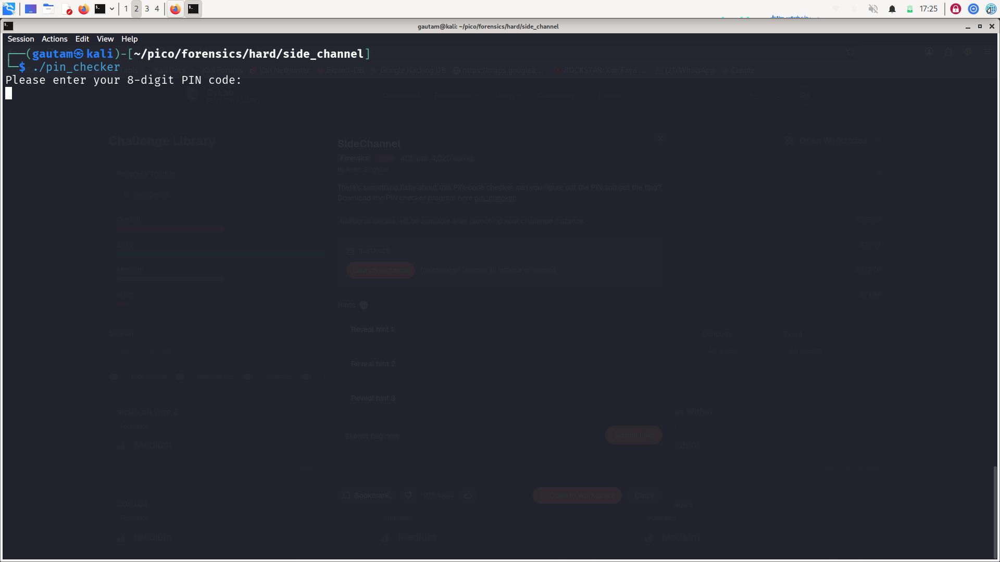
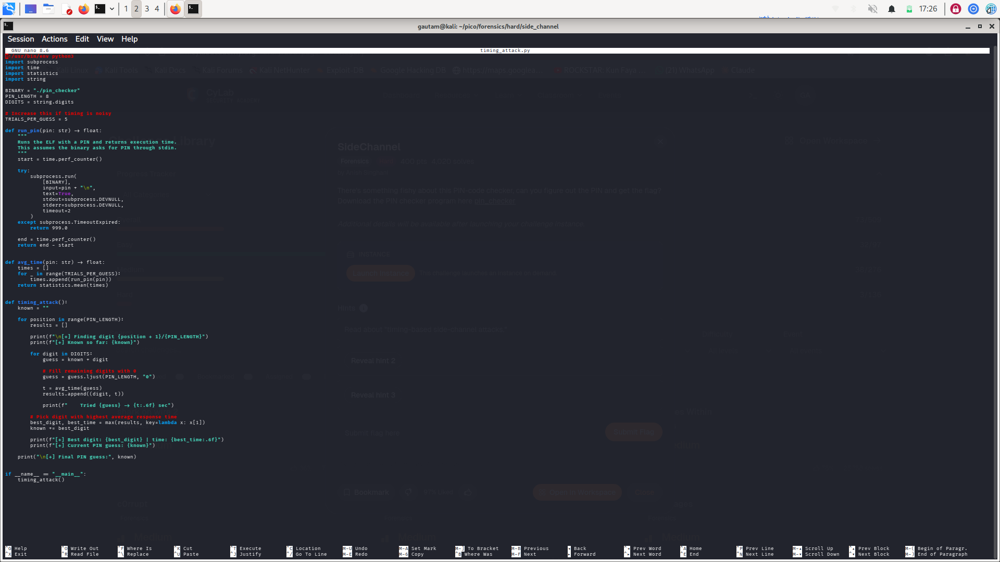
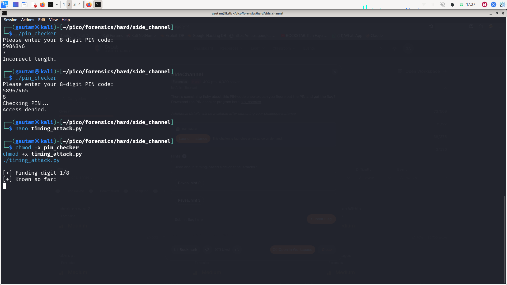
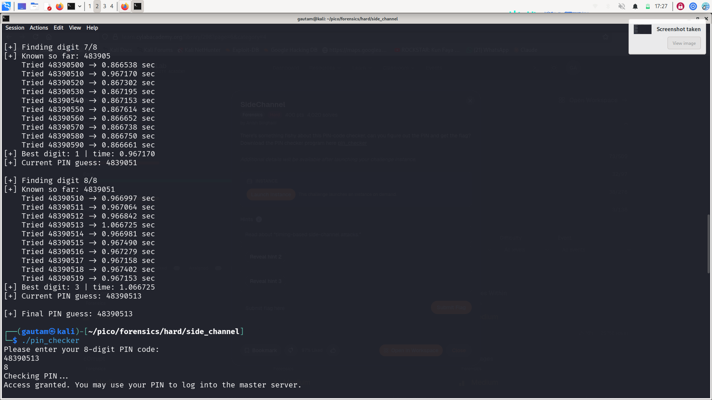
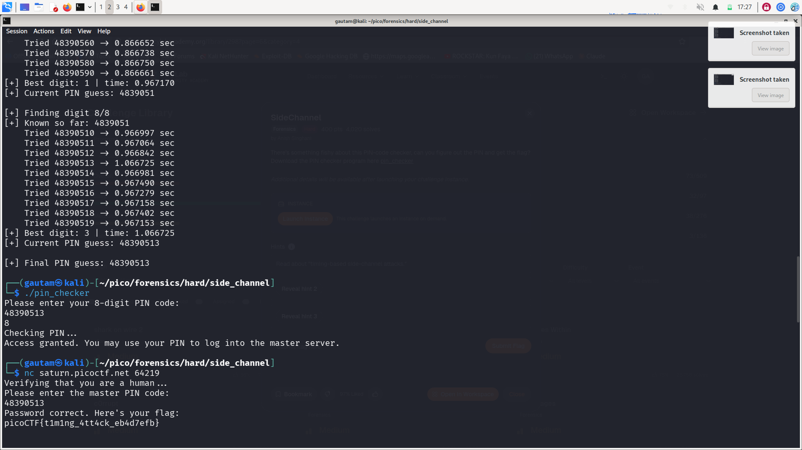

# SideChannel — picoCTF Writeup

## Challenge Information

| Field | Value |
|---|---|
| Challenge | SideChannel |
| Category | Forensics |
| Difficulty | Hard |
| Points | 400 |
| Goal | Find the correct 8-digit PIN and use it to get the flag |


## Description

The challenge gives a Linux ELF binary named `pin_checker`. The program asks for an 8-digit PIN. A wrong PIN shows `Access denied`, and the correct PIN gives access to the master server.

The important hint was about **timing-based side-channel attacks**. That means the program may take slightly longer when more starting digits of the input are correct.

## Initial Test

First, I ran the binary normally:

```bash
./pin_checker
```

The binary asked for an 8-digit PIN:



When a wrong-length input was entered, the program printed:

```text
Incorrect length.
```

When an 8-digit wrong PIN was entered, it printed:

```text
Checking PIN...
Access denied.
```

This confirmed that the input must be exactly 8 digits long.

## Attack Idea

The binary compares the PIN digit by digit. If the program exits faster for wrong digits and takes longer for correct prefix digits, we can recover the PIN one digit at a time.

For every position:

1. Keep the known correct prefix.
2. Try digits `0` to `9` at the next position.
3. Fill the remaining unknown digits with `0`.
4. Run the binary multiple times for each guess.
5. Measure the average execution time.
6. The digit with the highest average time is likely correct.

## Timing Attack Script

I used this Python script to automate the attack:

```python
#!/usr/bin/env python3
import subprocess
import time
import statistics
import string

BINARY = "./pin_checker"
PIN_LENGTH = 8
DIGITS = string.digits

# Increase this if timing is noisy
TRIALS_PER_GUESS = 5


def run_pin(pin: str) -> float:
    """
    Runs the ELF with a PIN and returns execution time.
    This assumes the binary asks for PIN through stdin.
    """
    start = time.perf_counter()

    try:
        subprocess.run(
            [BINARY],
            input=pin + "\n",
            text=True,
            stdout=subprocess.DEVNULL,
            stderr=subprocess.DEVNULL,
            timeout=2,
        )
    except subprocess.TimeoutExpired:
        return 999.0

    end = time.perf_counter()
    return end - start


def avg_time(pin: str) -> float:
    times = []
    for _ in range(TRIALS_PER_GUESS):
        times.append(run_pin(pin))
    return statistics.mean(times)


def timing_attack():
    known = ""

    for position in range(PIN_LENGTH):
        results = []

        print(f"\n[+] Finding digit {position + 1}/{PIN_LENGTH}")
        print(f"[+] Known so far: {known}")

        for digit in DIGITS:
            guess = known + digit

            # Fill remaining digits with 0
            guess = guess.ljust(PIN_LENGTH, "0")

            t = avg_time(guess)
            results.append((t, digit))

            print(f"    Tried {guess} -> {t:.6f} sec")

        # Pick digit with highest average response time
        best_time, best_digit = max(results, key=lambda x: x[0])
        known += best_digit

        print(f"[+] Best digit: {best_digit} | time: {best_time:.6f}")
        print(f"[+] Current PIN guess: {known}")

    print(f"\n[+] Final PIN guess: {known}")


if __name__ == "__main__":
    timing_attack()
```

Screenshot of the script:



## Running the Script

After saving the script as `timing_attack.py`, I made both files executable and ran the attack:

```bash
chmod +x pin_checker
chmod +x timing_attack.py
./timing_attack.py
```



The timing difference showed which digit was correct at each position. The script recovered the PIN step by step.

Example timing output:



The final recovered PIN was:

```text
48390513
```

## Verifying the PIN Locally

I tested the recovered PIN with the local binary:

```bash
./pin_checker
```

Input:

```text
48390513
```

The program accepted it:

```text
Access granted. You may use your PIN to log into the master server.
```

## Getting the Flag

Then I connected to the challenge server:

```bash
nc saturn.picoctf.net 64219
```

I entered the recovered PIN:

```text
48390513
```

The server accepted the PIN and printed the flag:



## Flag

```text
picoCTF{t1m1ng_4tt4ck_eb4d7efb}
```

## Conclusion

The challenge was solved using a timing-based side-channel attack. Because the program took more time when more prefix digits were correct, the PIN could be recovered one digit at a time without brute-forcing all `10^8` possible PINs.
